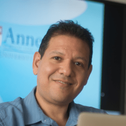
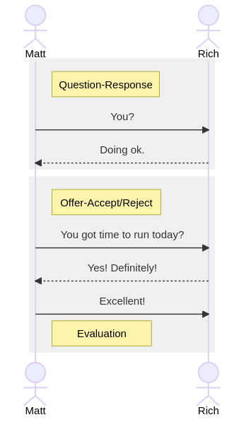
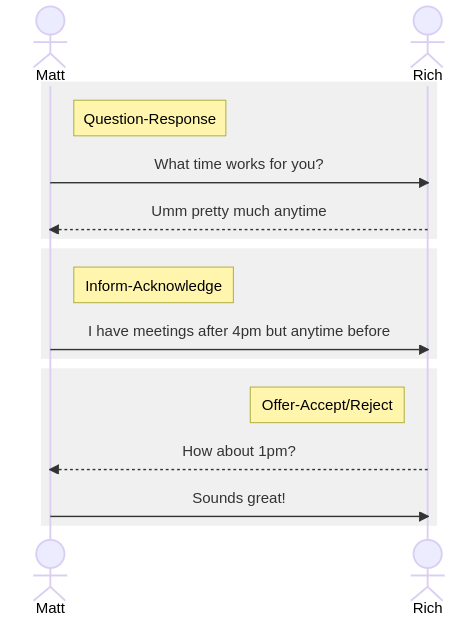

##  What happens when you put an LLM in a chatroom? 

<h3 style="text-align: center; color: #ffffed">Using theories of human communication to build LLM systems</h3>

Matt O'Donnell 
Tom Boccuto 
Richard Cardona 
Etienne Jacquot 
(ASC IT)

---

### Intro: Who We Are and Why This Matters

#### Annenberg = A school of communication—but what does that mean?
* We’re a *social science institution* focused on **human communication and its effects**.
    
* Our research spans media, public health messaging, political communication, digital technologies, and more.

 

#### Why GenAI? Because LLMs are communicators.
* We study communication—so we’re naturally interested in a tool that generates language, narratives, and influence.
    
* LLMs don’t just produce text; they participate in meaning-making.

---

### How ASC Is Engaging with GenAI

#### Practical Applications
- Faculty, staff, and students use LLMs in everyday workflows:
  - Drafting emails, articles, proposals.
  - Summarizing complex or large bodies of text.
  - Brainstorming ideas and outlining arguments. 
    
- Students use them as study aids, writing coaches, and creative partners.
    
- Recreational use is also a reality

---

### Institutional Support
- IT facilitates access to tools like `OpenAI`, `Claude`, `Gemini`, `Ollama` and `Microsoft Copilot`, and helps match tools to use cases.
    
- We support understanding around governance and data stewardship:
  - **Example** 
    - The Dean’s Office, working with sensitive university data, uses
      Penn-licensed Copilot/ChatGPT accounts for compliance and
      privacy.
    - In contrast, undergrad instructors using GenAI in a classroom
      experiment use controlled environments with API access for
      transparency and acceptable-use boundaries.
    
- We offer workshops and consultations to emphasize ethical, critical use.

---

### Come to this talk this afternoon!

##### Session 4 (3:00 - 3:50)

	

---
 
### Our Distinctive Lens as a Communications School
 

#### LLMs as Agents in the Communication Ecosystem
- We don’t just treat LLMs as productivity tools—they’re now actors in the broader discourse.
    
- They can *frame*, *reframe*, *persuade*, *obfuscate*, and *manipulate*.

 

#### Key Questions We Ask:
- What makes an LLM-generated message persuasive?
- How do audiences interpret AI-authored content?
- Can these tools reinforce bias, or spread misinformation?
- How do we teach students and the public to recognize and critically engage with AI-generated communication?

---

### IT's Role at Annenberg

#### Enabling Experimentation While Managing Risk
- We provide the infrastructure, training, and advisory support to encourage exploration while staying grounded in institutional policies.
- We evaluate tools carefully before recommending broad use.

 

#### Promoting Digital Literacy and Responsible Use
- Our goal is not just technical enablement, but critical engagement.
- We frame GenAI use in terms of privacy, ethics, and communicative impact.
- IT partners with researchers to support inquiry—not just implementation.

---

## ChatGPT 

#### 1. Communication Perspective

* **Chat** = Conversation?
  1. LLM *'chat'* very unlike human conversation
  2. Better understood as individual *request-response* cycles
  3. How can we build systems with LLMs that better engage in human conversation?

 

#### 2. IT Perspective

* **GPT** = Monolithic blackbox model?
  1. LLMs are parts of larger, complex **IT SYSTEMS**
  2. *Interconnected components* in *multiple stages*

---

### Example conversation between two humans

	
		
	

	
 <!-- .element: class="fragment" -->
		<pre style="color: #FADA5E">
	    Matt:    Hey Rich!
		Rich:    Hey! How are[you?]
		Matt:                [Good] thanks! 
		Matt:    Yo[u.?]
		Rich:      [Doi]ng[ ok...]
		Matt:             [You go]t time to run today?
		Rich:    Yes!D[efinitely!] 
		Matt:         [Excellent!]  What time works for you?
		Rich:    Umm pretty[ much anytime  ]
		Matt:              [I have meetings] after 4pm but anytime before
		Rich:    How about 1pm?
		Matt:    Sounds great!
		</pre>
	

	
 <!-- .element: class="fragment" -->

#### Conversation Analysis

- Cultural/conventional 'rules' for **TURN TAKING**
- **Adjacency Pairs** of turns for communicative functions
  - *greeting*, *question-answer*, *coordination*, *(dis)agreement*, *opening*, *closing*, etc.
- Transcription convention for representation speech
- Capturing key features of real conversation
  - Overlapping speech `[` `]`
  - Pauses
  - False starts & repairs

   

---

### Example conversation between two humans

* UML Sequence Diagram representation (`mermaid.js`)

	
 <!-- .element: class="fragment" -->
		
	

	
<!-- .element: class="fragment" -->
		 
	

	
<!-- .element: class="fragment" -->
		
	

---

### Chatting with `GPT4o`

**USER**: Hey Chat!

**ASSISTANT**: Hey there! 😊 How can I help you today?

**USER**: How are you?

**ASSISTANT**: Thanks for asking—I'm doing great and ready to help! 😊 How about you?

**USER**: Great thanks!

**ASSISTANT**: Awesome to hear! 😄 What can I do for you today?

**USER**: You got time to run today?

**ASSISTANT**: Absolutely—I’m always ready to run! 🏃‍♂️💨 What are we running through today? A task, some code, a workout plan, or maybe just a fun idea?

---

### Chatting with `Claude 3 Opus`

**USER**: Hey Chat!

**ASSISTANT**: Hello! How can I assist you today?

**USER**: How are you?

**ASSISTANT**: As an AI language model, I don't have feelings, but I'm functioning well and ready to help you with any questions or tasks you may have. How can I assist you today?

**USER**: I’m good too

**ASSISTANT**: I'm glad to hear you're doing well! Please let me know if there's anything specific I can help you with, such as answering questions, providing information, or offering suggestions on various topics. I'm here to assist you to the best of my abilities.

**USER**: You got time for a run today?

**ASSISTANT**: As an AI language model, I don't have a physical form, so I can't go for a run or engage in physical activities. My purpose is to provide information, answer questions, and assist with various tasks to the best of my abilities within the scope of our conversation. Is there something else I can help you with today?

---

### Mediated conversation (Teams)

---

### LLM Chat is not really *conversation*

* Cycles of `REQUEST - RESPONSE`

	

---

### LLM Chat is not really *conversation*

* Previous requests and responses become CONTEXT HISTORY

	

---

### Managing conversation history 

	

---

### Managing conversation history 

	

---

### Managing conversation history 

	

---

### Managing conversation history 

	

---

### Managing conversation history 

	

---

### Conversation in collaborative team tasks

- Conversation is a primary cultural/social tool for collaboration

- Think of any joint project you are involved in and the role that conversations have!

---

### Example: Developing a messaging campaign

	

---

### Example: Developing a messaging campaign

	

---
### Example: Developing a messaging campaign

	

---

### Example: Developing a messaging campaign

	

---

### Example: Developing a messaging campaign

	

---

### Example: Developing a messaging campaign

	

---

### LLMs used for team tasks

	

---

### Multiple users of a single LLM?

	

---

## Demo: *ourspace*

* https://ourspace.asc.upenn.edu/

---

## Demo: *ourspace*

* https://ourspace.asc.upenn.edu/

---

## Demo: *ourspace*

* https://ourspace.asc.upenn.edu/
  - To send request to LLM:
	1. Text prompt: `@ai [YOUR PROMPT]`
    2. Image generation: `@ai /draw [YOUR PROMPT]`

---

## Closing Perspective
- At ASC, we don’t see generative AI as just another tech trend—we see it as a communication phenomenon.
    
- Our job is to understand how it shapes thinking, behavior, and public discourse.
    
- We’re committed to staying ahead of the curve—not just in adopting tools, but in understanding their effects on people and society.

---

## Thank you!

Matt O'Donnell <a href="mbod@asc.upenn.edu">mbod@asc.upenn.edu</a>

Tom Boccuto <a href="thomas.boccuto@asc.upenn.edu">thomas.boccuto@asc.upenn.edu</a>

Richard Cardona <a href="richard.cardona@asc.upenn.edu">richard.cardona@asc.upenn.edu</a>

Etienne <a href="Jacquot etiennej@upenn.edu">Jacquot etiennej@upenn.edu</a>

---
